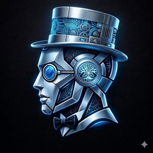
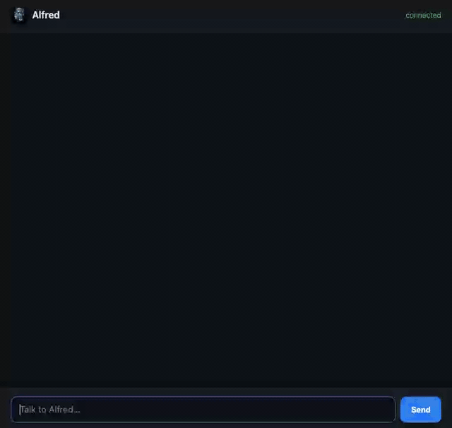
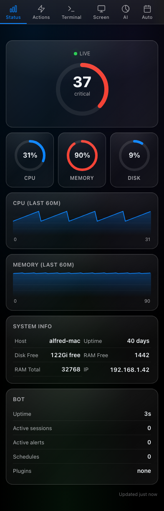
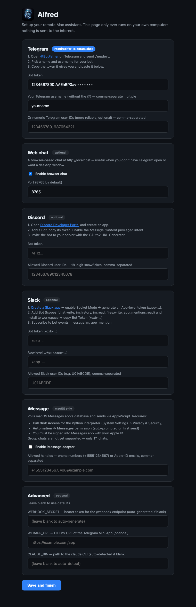
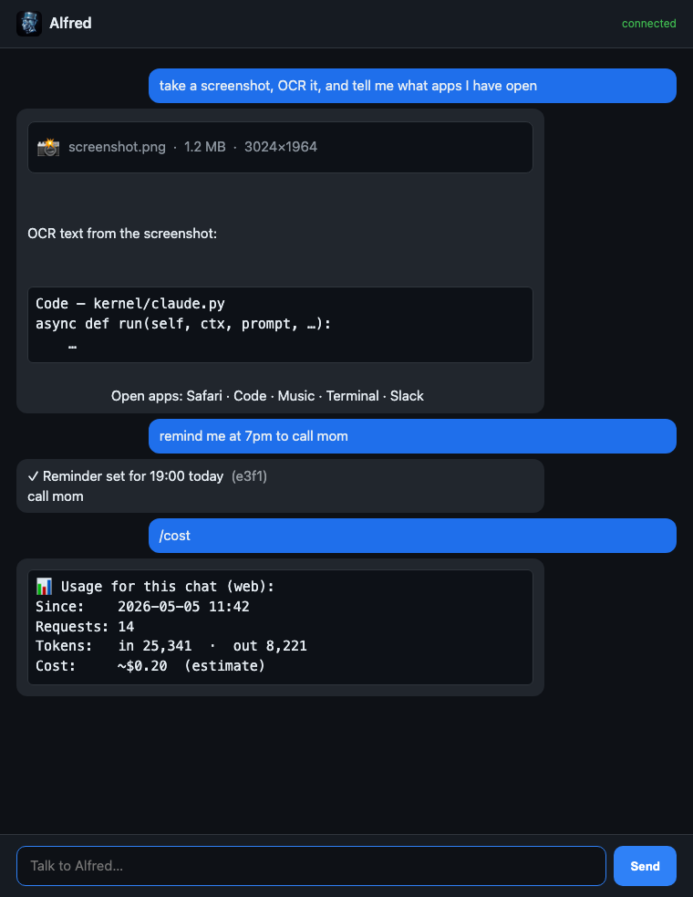

<p align="center">
  
</p>

<h1 align="center">Alfred</h1>

<p align="center">
  <em>The assistant who does the work and stays out of the spotlight.</em><br>
  Self-hosted Mac assistant powered by <a href="https://claude.com/claude-code">Claude Code</a> —
  Telegram · Discord · Slack · iMessage · Web.
</p>

<p align="center">
  <a href="https://github.com/TiGi-cloud/alfred-assistant/actions/workflows/ci.yml"></a>
  <a href="./LICENSE"></a>
  <a href="https://www.python.org/downloads/"></a>
  <a href="https://www.apple.com/macos/"></a>
</p>

---

## Why "Alfred"

Alfred Pennyworth is Batman's butler. He drives the car, hacks the computers, builds the gadgets, picks up the bullet wounds at 3 a.m., and gets about four lines of dialogue per movie. The character does the work; the hero gets the spotlight.

That's the brief. **Alfred is the assistant — not the protagonist.** No personality theatre, no "let me think about that" filler. You ask, Alfred does, you go on with your day. The bot's name is the thesis statement.

## Demo

<p align="center">
  
</p>

<sub>20 seconds. Three turns: screenshot, app list, cost. Same brain runs in Telegram, Discord, Slack, iMessage. (Demo screenshot is a mock desktop — the real bot returns your actual Mac.)</sub>

## What he does

```
You:    take a screenshot, OCR it, and tell me what apps I have open
Alfred: 📸 [photo arrives in chat]
        OCR text: …
        Open apps: Safari, Code, Music, Terminal, Slack
```

Alfred wraps the [Claude Code](https://claude.com/claude-code) CLI and surfaces it through five chat platforms with one shared brain — Telegram, Discord, Slack, iMessage, and a local browser chat. Same conversation memory wherever you address him. He inherits Claude Code's full agentic toolset (Bash, FileSystem, MCP servers, web fetch, …) so anything you can type at a terminal, you can ask Alfred to do over text.

A **dashboard Mini App** rides along — live CPU / memory / disk gauges, 60-minute sparklines, schedules, alerts, machines, cost, and a command palette. Embeds in Telegram via Cloudflare Tunnel, or open at `localhost:8765/dashboard` in any browser.

Mac-native by design: Vision OCR for photos you send him, AppleScript for app control, iMessage via `chat.db`, macOS Notification Center forwarding — all built in.

> ⚠️ **Self-hosted only.** Alfred runs shell commands on the host with no sandbox. **Do not host this for other people.** Each person should run their own Alfred on their own Mac.

## Screenshots

<table>
<tr>
<td width="33%" align="center" valign="top">
<a href="docs/assets/screenshots/dashboard-full.png">
  <br>
  <strong>Mini App dashboard</strong>
</a><br>
<sub>Live system gauges + sparklines. Embeds in Telegram as a Mini App, or open at <code>/dashboard</code> in any browser.</sub>
</td>
<td width="33%" align="center" valign="top">
<a href="docs/assets/screenshots/setup-wizard.png">
  <br>
  <strong>Setup wizard</strong>
</a><br>
<sub>Browser-based first-run config. No editing <code>.env</code> by hand — paste tokens, click Save.</sub>
</td>
<td width="33%" align="center" valign="top">
<a href="docs/assets/screenshots/web-chat.png">
  <br>
  <strong>Web chat (localhost)</strong>
</a><br>
<sub>Built-in chat at <code>localhost:8765</code> — same brain as Telegram, Discord, Slack, iMessage.</sub>
</td>
</tr>
</table>

> 

## Quick start

```bash
git clone https://github.com/TiGi-cloud/alfred-assistant.git
cd alfred-assistant
./install.sh                          # opens setup wizard at localhost:8080
```

Pick a chat platform in the wizard, click Save, then `python3 app.py`. **Five-minute walkthrough →** [docs/quickstart.md](docs/quickstart.md).

## Chat platforms

| Platform | Setup guide | Notes |
|---|---|---|
| **Telegram** | [setup/telegram.md](docs/setup/telegram.md) | Free bot token from @BotFather. Recommended starting point. |
| **Web (browser)** | [setup/web.md](docs/setup/web.md) | Built in — `http://localhost:8765`. No external account. |
| **Discord** | [setup/discord.md](docs/setup/discord.md) | Free bot. `pip install 'discord.py>=2.4'`. |
| **Slack** | [setup/slack.md](docs/setup/slack.md) | Free Slack app, Socket Mode. `pip install 'slack-bolt>=1.18'`. |
| **iMessage** | [setup/imessage.md](docs/setup/imessage.md) | macOS only. Polls `chat.db` + AppleScript send. 1:1 chats. |
| **Dashboard (Mini App)** | [setup/dashboard.md](docs/setup/dashboard.md) | Browser at `/dashboard`, or embed in Telegram via Cloudflare Tunnel. Live gauges + sparklines. |

Run any combination at once.

## What Alfred can do

**39 commands across every adapter** (full reference: [docs/commands.md](docs/commands.md))

| | |
|---|---|
| 📸 Screen | `/screenshot` `/record` `/watch` `/camera` `/ocr` |
| 🖥 System | `/status` `/processes` `/apps` `/battery` `/wifi` `/ip` `/uptime` |
| 🔊 Audio | `/volume` `/tts` |
| 📋 Clipboard + search | `/clipboard` `/paste` `/search` |
| 🤖 Automation | `/shortcut` `/focus` `/notifications` |
| 💬 Conversation | `/clear` `/fork` `/cost` |
| 🧠 Memory | `/memory` (stores facts across conversations) |
| ⏰ Reminders | `/remind` `/timer` `/schedule` `/alert` |
| 🌐 Multi-machine | `/machine` `/wake` |
| 📂 Projects | `/project` (per-user cwd + env + model) |
| 🔬 Deep research | `/research` (15 parallel Claude API calls) |
| 📧 Mail | `/gmail` (Mail.app or IMAP) |
| 🌍 Browser | `/web` + `[BROWSE:url]` (headless Chromium via Playwright) |
| 🎩 UI | `/start` `/menu` (tappable button grid) |
| 📊 Dashboard | live system gauges + 60-min sparklines + cost + schedules at `/dashboard` (also a Telegram Mini App) |

Plus: anything you say in plain text goes to Claude, which has full shell access.

## Architecture

```
kernel/        platform-agnostic types + services (Claude, scheduler, projects,
               machines, browser, store, dispatcher)
adapters/      one per chat platform (telegram, web, discord, slack, imessage)
actions/       slash-command handlers — each works on every adapter
app.py         single entry point
```

**For contributors:** [docs/architecture.md](docs/architecture.md). New chat platform = ~250 lines (subclass `kernel.ChatAdapter`). New command = ~20 lines (drop a file in `actions/`). [docs/plugins.md](docs/plugins.md) walks through it.

## How it differs from OpenClaw

[OpenClaw](https://github.com/openclaw/openclaw) is a sibling project with similar goals — also self-hosted, also multi-platform, also Claude-friendly. Use OpenClaw if you want **multi-LLM** (Claude + GPT + Gemini) and broader chat coverage including WhatsApp.

Alfred is **Claude-only**, but in exchange:

- **Wraps the Claude Code CLI directly** — inherits Claude's full tool ecosystem (Bash, file ops, MCP servers, web fetch). OpenClaw uses LLM APIs and ships its own tools.
- **Mac-native by default** — Vision OCR, AppleScript, iMessage `chat.db`, macOS notification forwarding are first-class.
- **Single binary on a single Mac** — minimum moving parts. No external services.

If you live on a Mac and want the deepest Claude Code integration, that's Alfred.

## Documentation

| Doc | Audience |
|---|---|
| [quickstart.md](docs/quickstart.md) | Users — first 5 minutes |
| [commands.md](docs/commands.md) | Users — every command, with examples |
| [setup/](docs/setup/) | Users — per-platform getting started |
| [security.md](docs/security.md) | Users — auth model, attack surface |
| [troubleshooting.md](docs/troubleshooting.md) | Users — when something doesn't work |
| [faq.md](docs/faq.md) | Users — common questions |
| [architecture.md](docs/architecture.md) | Developers — kernel + adapters + actions, with diagrams |
| [plugins.md](docs/plugins.md) | Developers — write your own slash command |
| [CONTRIBUTING.md](CONTRIBUTING.md) | Developers — workflow, style, what's welcome |
| [AGENTS.md](AGENTS.md) | AI agents — codebase rules + voice for Claude Code, Cursor, Codex, Aider, etc. |

## Stack

- Python 3.11+
- [Claude Code CLI](https://claude.com/claude-code) — driven via stream-json
- `python-telegram-bot` (Telegram), `aiohttp` (web), `discord.py` (Discord, optional), `slack-bolt` (Slack, optional)
- Playwright + Chromium (`/web`, optional)
- Anthropic SDK (`/research`, optional)
- macOS: `screencapture`, `osascript`, `pbpaste`/`pbcopy`, `mdfind`, Vision framework via AppleScriptObjC, ffmpeg + Whisper

## Contributing

PRs welcome. See [CONTRIBUTING.md](CONTRIBUTING.md). Don't add hardcoded paths, IPs, server names, or business logic — Alfred ships clean.

## License

MIT — see [LICENSE](./LICENSE).
